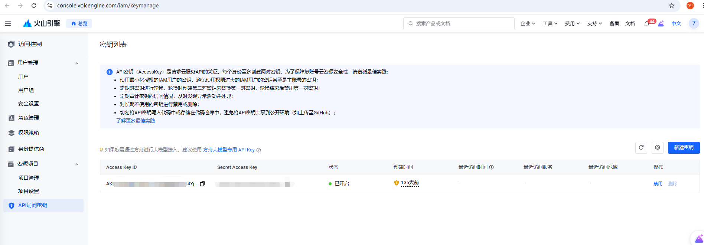
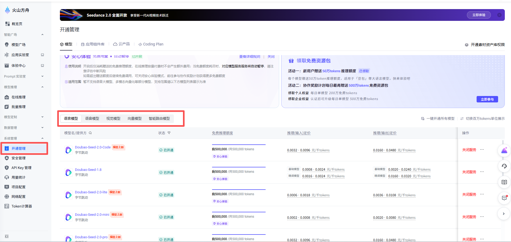
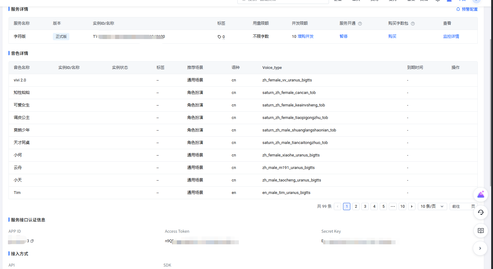

# Workflow Web

一个AI视频自动化生成、剪辑的工作流演示项目。
输入剧情文本后，可按阶段生成剧情结构、角色描述、角色定妆照（参考图）、镜头提示词、首帧图、视频、旁白，并支持自动合成视频、音频。


# 最大亮点
上手难度极低，小白程序员按照下面步骤也可十分钟内进行复现

# 视频展示
https://github.com/user-attachments/assets/f7464de5-4e68-4627-b655-bbde1d89c391

## 项目结构

```text
backend/   FastAPI 后端（工作流编排、任务队列、导出、视频合成）
frontend/  Vue 前端（参数配置、任务提交、进度展示、历史结果查看）
```

## 主要能力

- 剧情文本一键运行完整工作流
- 文本模型支持主模型 + 分阶段覆盖
- 图片模型、视频模型、TTS 参数可配置
- 任务化运行（创建任务 / 轮询状态 / 取消任务）
- 历史结果持久化与素材 ZIP 下载
- 基于 FFmpeg 的历史结果视频拼接（可带音频）

## 运行环境

- Python `3.12+`
- Node.js `18+`（建议 `20+`）
- npm `9+`
- FFmpeg（仅在使用“历史视频拼接 compose”功能时必需）

## 1. 克隆项目

```bash
git clone https://github.com/drose-yu/Auto_generate_vedio.git
```

## 2. 启动后端

### 2.1 创建虚拟环境并安装依赖

Windows PowerShell:

```powershell
cd backend
python -m venv .venv
.\.venv\Scripts\Activate.ps1
pip install -r requirements.txt
```

macOS / Linux:

```bash
cd backend
python3 -m venv .venv
source .venv/bin/activate
pip install -r requirements.txt
```

### 2.2 配置环境变量

在 `backend` 目录下：

```powershell
Copy-Item .env.example .env
```

然后编辑 `backend/.env`，至少填写：

```dotenv
APP_DOUBAO_API_KEY=your_doubao_api_key_here
APP_TTS_APP_ID=your_tts_app_id_here
APP_TTS_ACCESS_TOKEN=your_tts_access_token_here
APP_TTS_CLUSTER=volcano_tts
```
如何获取：
1.登陆火山引擎获取API_KEY
2.开通各类大模型服务（可白嫖一定额度）
3.获取tts的token、APP_ID：
搜索豆包语音合成模型2.0


### 2.3 启动后端服务

```powershell
uvicorn app.main:app --reload --port 8010
```

健康检查：

```powershell
curl http://127.0.0.1:8010/health
```

## 3. 启动前端

新开一个终端：

```powershell
cd frontend
npm install
npm run dev
```

默认访问地址：`http://127.0.0.1:5173`

前端已配置代理：

- `/api` -> `http://127.0.0.1:8010`
- `/health` -> `http://127.0.0.1:8010`

配置位置：`frontend/vite.config.ts`。

## 4. FFmpeg 安装（命令行）


### Windows（winget）

```powershell
winget install -e --id Gyan.FFmpeg
ffmpeg -version
```

### macOS（Homebrew）

```bash
brew install ffmpeg
ffmpeg -version
```

### Ubuntu / Debian

```bash
sudo apt update
sudo apt install -y ffmpeg
ffmpeg -version
```

只要 `ffmpeg -version` 能输出版本号，说明安装成功。


## 5. 常见问题

### 1) 报错：未配置 API Key

请确认 `backend/.env` 中已配置 `APP_DOUBAO_API_KEY`，并且后端是从 `backend` 目录启动的。

### 2) `ffmpeg not found`

说明系统 PATH 中没有 FFmpeg。按上面的安装步骤安装后，重开终端再运行。

### 3) 前端请求失败或跨域问题

确认后端在 `8010` 端口运行，前端在 `5173` 端口运行，且使用了项目自带的 Vite 代理配置。

### 4) 文本/图片/视频生成失败
可以自定义填入大模型的ID（Model ID可以在模型广场模块中点击你想接入的大模型，进入详情页就可以看到）

如：

    1.文本模型  doubao-seed-2-0-code-preview-260215
    2.图片模型  doubao-seedream-4-5-251128
    3.视频模型  doubao-seedance-1-5-pro-251215
